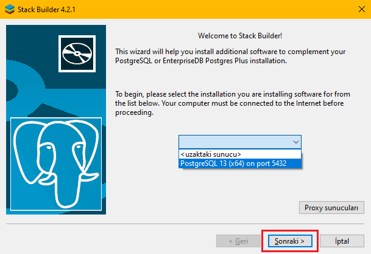
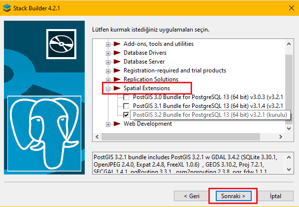
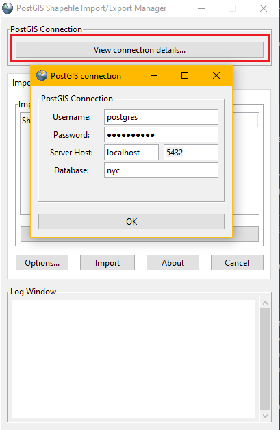
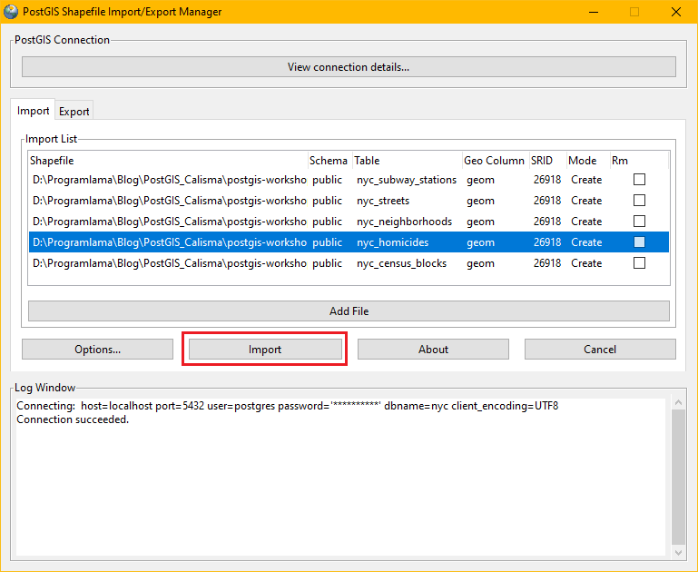

# ETKİN MEKANSAL VERİ YÖNETİM ARACI: POSTGIS

## 1. GİRİŞ
---

Bilgi ve iletişim teknolojilerinde yaşanmakta olan değişim ve dönüşüm her geçen gün hızını artırmakta ve insan hayatının neredeyse her alanına etki etmektedir. Yaşanan teknolojik gelişmeler sonucunda meydana gelen yeni ürün ve yöntemler ile insanlar yeni tecrübeler edinmekte ya da var olan deneyimlerini iyileştirmektedir. Teknolojinin getirdiği bu yenilikler sonucunda veri kaynakları artmış, yeni depolama yöntemleri ve analiz araçları geliştirilmiştir.

Veri, en genel anlamda bir amaç doğrultusunda sistematik olarak toplanan her türlü harf, rakam ya da ‘değer’ler topluluğu olarak tanımlanabilir. Veri üretilirken ilgili amaç doğrultusunda “Ne?” sorusunda yanıt aranır. Bununla birlikte herhangi bir nesne ya da olgunun coğrafi konumunu ifade etmek için kullanılan veriye ise konumsal veri denir [1]. Konumsal veri oldukça fazla hata içerdiğinden geliştirilen ürünlerin kalitesine doğrudan etki etmektedir. Ancak geliştirilen ürün sayısı arttıkça kaliteli veriye ihtiyaç artacak ve konumsal veri kalitesine de olumlu etki yapacaktır [10]. Günümüzde çeşitli kaynaklardan üretilen verinin çok büyük bir bölümünün konuma dayalı olduğu düşünüldüğünde bu verinin depolanması ve analizi büyük önem arz etmektedir.

Üretilen verinin kullanılabilmesi ve fayda sağlaması için işlenerek bilgiye dönüştürülmesi gerekmektedir. Bu sebeple veri, bilginin ham maddesi olarak da tanımlanabilir. Veriyi gerektiğinde çağırarak faydalı bilgi üretmek ve etkili bir biçimde kullanmak için ise etkin bir şekilde depolamak gereklidir. 1970 yılında E. F. Codd tarafından açıklanan ilişkisel veri tabanı modeli sağladığı avantajlar dolayısıyla en popüler ve etkin veri depolama yaklaşımlarından biridir [2].

PostgreSQL günümüzün en popüler ilişkisel veri tabanı yönetim sistemlerinden biridir. Arkasında büyük bir açık kaynak kod geliştirme topluluğu bulunan PostgreSQL, SQL standartlarını destekler, hızlı, güçlü ve yüksek güvenlikli bir veri tabanı çözümü sunar [3]. Ticari yazılımların hemen hemen tüm özelliklerini destekleyen ve aynı zamanda kendine has özellikler içeren bir sistemdir [2]. Mekansal veri yönetimi için oldukça güçlü bir çözüm sunan PostGIS eklentisi ile mekansal veriyi destekleyen ilk veri tabanı yönetim sistemlerinden biri olmuştur [4]. 

PostGIS, binden fazla mekansal fonksiyonu bulunan en verimli açık kaynak kodlu mekansal veri yönetim aracıdır [5]. Çeşitli GIS yazılımları (QGIS, ArcGIS vb.) ile de entegre bir şekilde kullanılabilmektedir ve açık kaynak kodlu olduğu için gelişime açıktır. Aynı zamanda mobil ya da konum tabanlı uygulama gerçekleştirmek için de oldukça performanslı bir araçtır. PostgreSQL kurulumundan sonra basit bir prosedür izlenerek sunucuya dahil edilen PostGIS istenilen veri tabanına basit bir SQL cümlesiyle eklenir. PostGIS eklentisinin eklenmesi ile PostgreSQL’in temel veri tipleri ve fonksiyonları genişletilerek mekansal veri tipleri ve mekansal fonksiyonlar kullanılabilir duruma getirilir. Vektör ve raster veri desteği bulunan PostGIS’te koordinat dönüşümü, uzunluk ve alan hesaplamaları, mekansal ilişkilerin sınanması gibi birçok işlem kolay ve hızlı bir şekilde gerçekleştirilebilir.

Bu yazıda PostGIS kurulumundan başlanarak örnek bir vektör veri seti üzerinde kullanışlı PostGIS fonksiyonları aktarılarak kullanım örneklerine yer verilecektir.

## 2. POSTGIS KURULUMU
---

PostGIS kurulumundan önce bilgisayarda PostgreSQL kurulu olmalıdır. Eğer kurulu değilse [bu adresten](https://www.postgresql.org/download/)  kullanılacak bilgisayarın işletim sistemine uygun sürüm indirilerek temel kurulum adımları izlenerek kurulum yapılabilir. Daha sonra lokal sunucuya erişmek için kullanılacak olan master kullanıcı parolası kurulum adımında belirlenir ve unutulmamalıdır. 

Windows işletim sistemine sahip bilgisayarlar için PostGIS eklentisini sunucuya dahil etmek için farklı bir prosedür izlenmektedir. PostgreSQL sunucusuna ek seçenek ve eklenti kurulmasına olanak tanıyan ve PostgreSQL kurulumu ile birlikte gelen Stack Builder uygulaması ile PostGIS eklentisi aşağıdaki işlem adımları takip edilerek sunucuya kurulabilir [6]. Mac işletim sistemine sahip cihazlar için [bu adresten](https://postgresapp.com/) PostGIS'i de içeren PostgreSQL sürümü indirilip yönergeler takip edilerek kurulum yapılabilir. 

1. PostgreSQL kurulumu ile birlikte gelen Stack Builder uygulaması çalıştırılır ve yapılandırmak istenilen sunucu seçilerek "Sonraki" butonu ile bir sonraki adıma geçilir.

<figure>
    
</figure>

2. Uygulama listesi okunduktan sonra gelen ekranda kategorize edilmiş şekilde sunucuya eklenebilecek özellikler yer almaktadır.  “Spatial Extensions” kategorisi altına gidilerek ilgili PostGIS sürümünü seçip "Sonraki" butonu ile bir sonraki adıma geçilir.  

<figure>
    
</figure>

3. Seçilen paketleri gözden geçirme ekranı gelecektir. Bu ekranda "Sonraki" butonuna tıklanarak temel kurulum adımlarına geçilir. Bu aşamada önerilen ayarları izleyerek PostGIS eklentisi sunucuya dahil edilebilir.

4. PostGIS eklentisi sunucuya dahil edilse de eklenti ile birlikte gelen veri tipi ve fonksiyonları kullanabilmek için ilgili veri tabanında da eklentiyi kurmak gereklidir. Bu işlemi aşağıdaki komutu bir kere çalıştırarak gerçekleştirebilir PostGIS fonksiyonlarını kullanmaya başlayabiliriz.

```sql 
CREATE EXTENSION postgis; 
```

5.	Kurulum sorunsuz bir şekilde tamamlandıktan sonra test etmek adına aşağıdaki komut çalıştırılabilir. Bu komut PostGIS fonksiyonlarından biridir ve kullanılan sürüm hakkında bilgi mesajı döndürür.

```sql
SELECT postgis_verison();
-- Çıktı: "3.0 USE_GEOS=1 USE_PROJ=1 USE_STATS=1"
-- postgis_full_version() fonksiyonu ile daha detaylı bilgi alınabilir.
```

Kullanılan PostGIS sürümüne ait bilgiler sorunsuz şekilde ekrana yazıldığı takdirde kurulum tamamlanmış, kullanıma hazırdır.

## 3. MEKANSAL VERİ EKLEME
---

PostGIS kurulumu sorunsuz bir şekilde tamamlandıktan sonra yeni bir veri tabanı oluşturarak örnek mekansal veri setini yükleyebiliriz. Bu yazıda [bu adresteki](https://postgis.net/workshops/postgis-intro/) New York şehrine ait örnek veri seti kullanılarak uygulamalar gerçekleştirilecektir. Aynı zamanda kurulum ve veri seti hakkında daha detaylı bilgiye bu sayfadan erişilebilir. 

Öncelikle “nyc” isimli bir veri tabanı oluşturalım ve PostGIS eklentisini bu veri tabanına dahil edelim.

```sql 
CREATE DATABASE nyc;
CREATE EXTENSION postgis; 
```

PosgreSQL veri tabanına mekansal veri eklemenin farklı yolları vardır. Çeşitli CBS yazılımları ya da kütüphaneleri ile bu işlem gerçekleştirilebilir. Ancak PostGIS’in bu konuda sağlamış olduğu basit bir Loader uygulaması vardır. *.shp ve *.dbf uzantılı mekansal verileri import etmekte ya da veri tabanında bulunan mekansal verileri export emekte kullanımı kolay bir çözüm sunar.

Kurulum ile birlikte gelen PostGIS Loader uygulaması çalıştırılır ve ana ekranda bulunan “View Connection Details” butonuna tıklanarak açılan ekranda gerekli bilgiler doldurulur. Bu bilgiler doğrultusunda uygulama verilerin ekleneceği veri tabanı ile bağlantı yapacaktır.

<figure>
    
</figure>

Daha sonra “Add File” butonu ile veri tabanına eklenecek olan *.shp uzantılı dosyalar seçilerek SRID değerleri ayarlanır. SRID değeri veri setinin koordinat sistemini ve sisteme ait parametreleri ifade eden bir kod olarak düşünülebilir. Bu kavram ile ilgili daha detaylı bilgiye ilerleyen bölümlerde değinilecektir. Kullanılacak veri seti için SRID değeri 26918 olarak girilmelidir. Son olarak "Import" butonuna tıklanır ve dosyalar bağlantı yapılan veri tabanına tablo olarak eklenir.

<figure>
    
</figure>

## 4. KOORDİNAT SİSTEMLERİ VE SRID KAVRAMI
---

Koordinat referans sistemleri, konumsal bilgilerin uzayda tek anlamlı bir şekilde ifade edilebilmesi için gerekli olan sabit katsayılar ve parametreleri tanımlar. Konumsal verinin anlam ifade edebilmesi ve analizlerde kullanılabilmesi için oldukça önemli bir kavramdır. Koordinat referans sistemlerinin tanımlanması için farklı sabitler ve parametreler kullanıldığndan standart bir koordinat tanımlama dili oluşturmak adına EPSG (European Petroleum Survey Group) kodları kullanılmaktadır. Bu şekilde hem ifade kolaylığı sağlanmış hem de ortak bir dil oluşturulmuştur. EPSG kodu PostGIS eklentisinde SRID olarak düşünülebilir.

Dünyanın şeklinden kaynaklı olarak haritalama işlemlerinde bozulmalar meydana gelmektedir. Bu bozulmalar koordinat sisteminin merkezinde en az olmak üzere kenarlara doğru gidildikçe artmaktadır. Dolayısıyla lokal çalışmalarda o bölgeyi en iyi ifade eden, en az bozulmaya sebep olan koordinat sistemi kullanılmaktadır. Tanımlı birçok koordinat sistemi bulunmakla birlikte PostGIS içerisinde gelen “spatial_ref_sys” tablosunda 8500 adet koordinat sistemi bulunmaktadır. Ülkelerde kullanılan koordinat sistemleri ve tanımlı koordinat sistemlerinin parametrelerine [epsg.io](https://epsg.io/) adresinden ulaşılabilir.

Konumsal analizlerin anlamlı bir sonuç verebilmesi için veri setlerinin aynı koordinat sisteminde olması gerekmektedir. Verilerin çeşitli kaynaklardan temin edildiği göz önüne alındığında analiz yapmadan önce koordinat dönüşümü yapmak gerekebilir. PostGIS eklentisi ile birlikte gelen fonksionlar ile koordinat dönüşümü ve koordinat tanımı değiştirme gibi işlemler basit SQL sorguları ile gerçekleştirilebilmektedir.

### 4.1. ST_SRID(geom)

Mekansal veri tabanındaki geometri sütununu girdi olarak alan bu fonksiyon tablodaki her kayıt için bir tam sayı döndürür. Bu tam sayı koordinat sistemi id’sini (EPSG kodu ya da SRID) ifade eder [9].

```sql
-- Örnek Kullanım:
SELECT ST_SRID(geom) FROM nyc_homicides; 
-- Çıktı: 26918 (Her kayıt için)
```

Bir tablodaki bütün kayıtların aynı SRID değerine sahip olması beklenir. Her kayıt için dönen bu sonuç ST_SRID komutu ile DISTINCT cümleciği birlikte kullanılarak tek satıra indirgenebilir.

```sql
-- Örnek Kullanım: 
SELECT DISTINCT(ST_SRID(geom)) FROM nyc_homicides;
-- Çıktı: 26918
```

Benzer şekilde Find_SRID fonksiyonu kullanılarak bu sonuca ulaşılabilir. Tablonun bulunduğu şemayı, tablo adını ve geometri kolonunu girdi olarak alan bu fonksiyon çıktı olarak bir tam sayı verir ve bu tam sayı SRID değerini ifade eder [9].

```sql 
-- Örnek Kullanım:
SELECT Find_SRID(‘public’,’nyc_homicides’,’geom’);
-- Çıktı: 26918 
```

### 4.2. ST_SetSRID(geom,srid)

ST_SetSRID fonksiyonu bir geometrideki SRID değerini yani koordinat sistemini ifade eden kodu belirli bir tamsayı değerine atamak için kullanılır. __Bu fonksionun koordinat dönüşümü işlemini gerçekleştirmediğine, sadece koordinat sisteminin tanımını değiştirdiğine dikkat edilmelidir.__ Bu fonksiyonun kullanılmasıyla geometrinin içinde olduğu varsayılan koordinat sistemini tanımlayan meta verileri değiştirdiğine dikkat edilmelidir [9].

Paramatre olarak bir geometri sütunu ve koordinat sistemini ifade eden bir SRID değeri alır. Koordinat sistemi tanımı değiştirilmiş yeni geometrileri çıktı olarak döndürür.

```sql 
-- Örnek Kullanım: 
SELECT ST_SRID(ST_SETSRID(geom, 4326)) 
FROM nyc_homicides;
-- Çıktı: 4326
```

ST_SetSRID fonksiyonu koordinat tanımını değiştirse de tabloda güncelleme yapmamaktadır. UpdateGeometrySRID fonksiyonu ile koordinat tanımını değiştirerek aynı zamanda tabloda da güncellenmesini sağlayabiliriz [9].

Tablo adı, geometri kolonu ismi ve hedef SRID değerini girdi olarak alan bu fonksiyon çıktı olarak değişimin başarılı olduğuna dair mesaj üretmektedir.

```sql
-- Örnek Kullanım:

SELECT UpdateGeometrySRID('nyc_homicides', 'geom', 4326);
--Çıktı: public.nyc_homicides.geom SRID changed to 4326
```

### 4.3. ST_Transform(geom, srid)

Bir geometrinin koordinatlarını bir koordinat sisteminden başka bir koordinat sistemine dönüştüren fonksiyondur. Genellikle ST_SRID fonksiyonu ile karıştırılsa da bu fonksyion doğrudan koordinat dönüşümü yapmaktadır. Girdi olarak geometri sütununu ve hedef koordinat sisteminin SRID değerini alan fonksyion çıktı olarak koordinatları dönüştürülmüş yeni bir geometri sütunu döndürür [9].

```sql 
-- Örnek Kullanım:

SELECT ST_SRID(ST_Transform(geom, 4326)) 
FROM nyc_homicides;
-- Çıktı: 4326
```

## 5. GEOMETRİ DOĞRULAMA
---

Veri tabanına eklenen ya da çeşitli fonksiyonlarla veri tabanında oluşturulan geometri verilerinde topolojik hatalar olabilir. Geometri verilerinde meydana gelen bu hatalar kullanılacak diğer fonksiyonların çalışmasını engelleyebilir ya da yanlış çalışmasına sebep olabilir. Geometri doğrulama fonksiyonları ile ilgili geometri verilerinin OGC SFS standartlarına göre geçerli olup olmadığı test edilebilir ve hatalar giderilebilir. Eğer varsa hatalar hakkında detaylı bilgi alınabilir.

### 5.1. ST_IsValid(geom)

Parametre olarak verilen geometri verisinin geçerliliğini test eder ve geriye boolean değer döndürür [9].

```sql
-- Örnek Kullanım: 

SELECT ST_Isvalid(geom) FROM nyc_homicides;
/*
Çıktı:
True
...
*/
```

ST_Isvalid fonksiyonu ile geçersiz olan geometri verileri için false değer dönecektir. Geçersiz geometrilerin neden geçerli olmadığı hakkında bilgi almak için fonksiyon ST_IsvalidDetail fonksiyonu kullanılmalıdır [9].

```sql 
-- Örnek Kullanım:

SELECT ST_IsvalidDetail(geom) FROM nyc_homicides;
/*
Çıktı:
True
...
*/
```

Benzer şekilde çalışan bir başka fonksiyon ise ST_IsvalidReason fonksiyonudur. Girdi olarak geometri verisi alır ve text döndürür. Sonuç geçerli ise “Geçerli geometri” mesajı, değil ise neden geçerli olmadığını belirten bir mesaj döndürür [9].

```sql
-- Örnek Kullanım:
SELECT ST_IsvalidReason(geom) FROM nyc_homicides;
/*
Çıktı:
Valid Geometry
...
*/
```

### 5.2. ST_MakeValid(geom)

ST_MakeValid fonksiyonu, geçersiz bir geometri verisi için köşe noktalarından herhangi birini kaybetmeden OGC standartlarına göre geçerli bir temsilini oluşturur. Geçerli geometriler üzerinde herhangi bir değişiklik yapılmadan aynı şekilde geri döndürülür [9].

```sql 
-- Örnek Kullanım:

SELECT ST_MakeValid (geom) FROM nyc_homicides;
-- Çıktı: Düzeltilmiş PostGIS geometrisi
```

## 6. GEOMETRİ GİRİŞİ FONKSİYONLARI
--- 

PostGIS fonksiyonları içerinde çeşitli format ya da metinsel ifadeler kullanılarak veri tabanına geometri girişini sağlayan fonksiyonlar vardır. Bunlardan başlıcaları ST_GeomFromText, ST_GeomFromGeojson, ST_GeomFromGML ve ST_GeomFromKML fonksiyonları olarak sıralanabilir. 

### 6.1. ST_GeomFromText(WKT, srid)

OGC WKT temsili olan metinsel bir ifadeden geometri oluşturan fonksiyondur. Eğer SRID değeri parametre olarak verilmezse varsayılan olarak 0 değeri atanır. Bu durum sorgulama esnasında hataya sebep olacağından doğru kullanım veri girişi esnasında SRID değerini de girerek koordinat sistemini doğru şekilde tanımlamak olacaktır [9].

```sql 
-- Örnek Kullanım:

SELECT 
ST_GeomFromText('LINESTRING(-71.160281 42.258729,-71.160837 42.259113,-71.161144 42.25932)',4269); 
```

Metin verisinden geometri oluşturan fonksiyon olduğu gibi geometri verisini metinsel olarak export eden fonksiyon da vardır. ST_AsText fonksiyonu ile geometri verisini geometri türü (nokta, çizgi, poligon) ve koordinatlar olacak şekilde metinsel olarak çıktı alabiliriz. 

### 6.2. ST_GeomFromGeojson(geojson)

Geojson temsilinden PostGIS geometri verisi oluşturan fonksiyondur. Ancak yalnızca JSON belgesinin geometri kısımları için kullanılmalıdır. Tüm belge için kullanıldığında hataya sebep olacaktır [9].

```sql 
--Örnek Kullanım:

SELECT ST_GeomFromGeoJSON('{"type":"Point","coordinates":[-48.23456,20.12345]}'); 
```

Benzer şekilde ST_AsGeoJson fonksiyonu ile geometri verisinden geojson verisi elde edilebilir.

### 6.3. ST_GeomFromGML(gml)

OGC GML formatında tanımlanmış geometri verisini PostGIS geometri verisi formatında döndürür. Ancak yalnızca GML’in geometri kısımları için kullanılmalıdır. Tüm GML belgesinde kullanılması halinde hataya sebep olacaktır [9].

```sql
-- Örnek Kullanım:

SELECT ST_GeomFromGML('
		<gml:LineString srsName="EPSG:4269">
			<gml:coordinates>
				-71.16028,42.258729 -71.160837,42.259112 -71.161143,42.25932
			</gml:coordinates>
		</gml:LineString>');
```

ST_AsGML fonksiyonu kullanılarak PostGIS geometrisinden OGC GML geometri tanımı elde edilebilir.

### 6.4. ST_GeomFromKML
OGC KML temsilinden PostGIS geometri nesnesi oluşturur. KML tanımının yalnızca geometri kısımları için kullanılmalıdır [9]. Aksi takdirde hataya sebep olacaktır.

```sql
-- Örnek Kullanım:

SELECT ST_GeomFromKML('
		<LineString>
			<coordinates>-71.1663,42.2614
				-71.1667,42.2616</coordinates>
		</LineString>');
```

ST_AsKML fonksiyonu ile postgis geometrisinden OGC KML verisi elde edilebilir. Yine yalnızca geometri kısmı için geçerlidir. 

## 7. TOPOLOJİK İLİŞKİLER
---

PostGIS, geometrilerin uzayda birbirine göre durumlarını sınayan bir dizi fonksiyona sahiptir. Bu fonksiyonlar kullanılarak mekansal veriler arasındaki ilişkileri sorgulayabilir aynı zamanda çeşitli mekansal analizleri gerçekleştirebiliriz.

Bu bölümde geometrilerin birbirlerine göre durumlarını sınayan PostGIS fonksiyonları üzerinde durulmuştur. A ve B değişkenlerinin birer PostGIS geometrisi olduğu düşünülmelidir.

### 7.1. ST_Contains(A, B)

Girdi olarak iki adet geometri alan bu fonksiyon geometrilerin biribiri içinde olup olmadığını kontrol ederek sonucu boolean bir değer olarak döndürür. B geometrisi, tamamen A geometrisinin içerisinde ise True değer dönecektir [9]. Boolean değer döndürmesi sebebiyle where cümleciği ile ya da join işlemlerinde kullanılabilir.

```sql
-- Örnek Kullanım: Mahallelerdeki metro istasyonu sayılarını veren mekansal sorguda st_contains foksiyonu kullanılabilir.

SELECT
  neighborhoods.name AS neighborhood_name,
  COUNT(*) AS number_of_subway
FROM nyc_neighborhoods AS neighborhoods
JOIN nyc_subway_stations AS subways
ON ST_Contains(neighborhoods.geom, subways.geom)
GROUP BY neighborhoods.name
```

### 7.2. ST_Crosses(A, B)

Girdi olarak iki geometri alan bu fonksiyon ile geometrilerin uzayda kesişimi sınanır. Geometrilerin en az bir ortak noktaları varsa ve tümü ortak değilse true değer döndürür [9].

```sql
-- Örnek Kullanım: Mahalle sınırları ile kesişen yolların adı ve tipini getiren bir sorgu için st_crosses fonksiyonu kullanılabilir.

SELECT streets.name, streets.type
FROM nyc_streets as streets, nyc_neighborhoods as neighborhoods
WHERE st_crosses(streets.geom, neighborhoods.geom)
```

### 7.3. ST_Disjoint(A, B)

İki geometri için uzayda ayrıklığı sınayan fonksiyondur. Eğer paramere olarak alınan iki fonksiyon için bindirme ya da kesişme söz konusu değilse geometriler ayrıktır ve true değer döner. Aksi takdirde false değer dönecektir [9].

```sql
-- Örnek Kullanım:

SELECT ST_Disjoint('POINT(0 0)'::geometry, 'LINESTRING ( 2 0, 0 2 )'::geometry) as result;
```

### 7.4. ST_Equal(A, B)

İki geometri mekansal olarak eşit ise true değeri döndürür. Geometrilerin noktalarının sıralaması farklı olsa da aynı geometri yapısında olduğu için true döndürecektir. Eşit operatörüne göre daha iyi sonuç verir [9].

```sql
-- Örnek Kullanım:

SELECT ST_Equals(ST_GeomFromText('LINESTRING(0 0, 10 10)'),
    ST_GeomFromText('LINESTRING(0 0, 5 5, 10 10)')) as result;
```

### 7.5. ST_Intersects(A, B)

Girdi olarak alınan iki postgis geometri verisi kesişiyorsa true değer döndürür. ST_Overlaps, ST_Touches, ST_Within fonksiyonları ile de kesişim kontrol edilebilir. Bu fonksiyonlardan herhangi biri true değer döndürüyor ise kesişim vardır denebilir. ST_Disjoint fonksiyonu ayrıklığı temsil ettiği için true değer döndürmesi durumunda kesişim yoktur [9].

```sql
-- Örnek Kullanım: Mahalle sınırlarını kesen en uzun yol

SELECT 
	MAX(st_length(nyc_streets.geom)) AS en_uzun_yol
FROM nyc_streets, nyc_neighborhoods 
WHERE st_intersects(nyc_streets.geom, nyc_neighborhoods.geom);
```

### 7.6. ST_Overlaps(A, B)
Girdi olarak alınan geometriler mekansal olarak örtüşüyorsa true değeri döndürür. Burada örtüşmeden kasıt kesişmenin olması ancak geometrilerden birinin diğerini tam olarak içermemesidir [9].

```sql
-- Örnek Kullanım:

SELECT st_overlaps(nyc_census_blocks.geom, nyc_neighborhoods.geom) as result, 
COUNT(*)
FROM nyc_census_blocks, nyc_neighborhoods
GROUP BY result
```

### 7.7. ST_Touches(A, B)

Parametre olarak alınan geometriler kesişiyor ancak bu kesişim noktası geometrilerin sınır noktasındaysa true döndürür. Nokta geometriler için sınır söz konusu olmadığından bu fonksiyon için daima false değer dönecektir [9].

```sql
-- Örnek Kullanım:

SELECT  
	ST_Touches(public.nyc_census_blocks.geom, public.nyc_neighborhoods.geom) as result, 
	COUNT(*) as number_of_touches
FROM public.nyc_neighborhoods, public.nyc_census_blocks
GROUP BY result
```

### 7.8. ST_Within(A, B)

A geometrisi tamamen B geometrisinin içindeyse true döndürür. Ancak bu ve diğer mekansal ilişki fonksiyonlarının anlamlı bir sonuç üretebilmesi için verilerin aynı koordinat sisteminde olması gerekmektedir [9].

ST_Within(A,B) ve ST_Within(B,A) aynı anda true değer döndürüyor ise, o zaman iki geometrinin uzamsal olarak eşit olduğu kabul edilir.

```sql
-- Örnek Kullanım: Mahalle bazlı cinayet sayılarının bulunması

SELECT 
	nyc_neighborhoods.name, 
	COUNT(*) as number_of_homicides
FROM public.nyc_homicides, public.nyc_neighborhoods
WHERE st_within(nyc_homicides.geom, nyc_neighborhoods.geom)
GROUP BY nyc_neighborhoods.name
ORDER BY number_of_homicides DESC
```

## 8. ÖLÇÜM FONKSİYONLARI
---

PostGIS veri tabanında depolanan geometri verileri için yine PostGIS fonksiyonları kullanılarak uzunluk, alan, çevre hesabı gibi birçok hesap yapılabilir.

### 8.1. ST_Area(A)

Parametre olarak aldığı çokgenin alanını döndürür. Geometri verileri için alan hesaplama işleminde koordinat sisteminin metrik olmasına dikkat edilmelidir. Çünkü hesaplanan alan koordinat sisteminin biriminde dönecektir [9].

```sql
-- Örnek Kullanım: Mahallelerin alanlarını hesaplayıp büyükten küçüğe sıralanması

SELECT name, st_area(geom) AS area
FROM nyc_neighborhoods
ORDER BY area DESC
```

### 8.2. ST_ClosestPoint(A, B)

A geometrisinde B geometrisine en yakın olan iki boyutlu nokta verisini geri döndürür. 3 boyutlu geometriler için ST_3DclosestPoint fonksiyonu tercih edilmelidir [9].

```sql
-- Örnek Kullanım: 

SELECT ST_ClosestPoint(
	ST_GeomFromText('POINT(100 100)'),
	ST_GeomFromText('LINESTRING (20 80, 98 190, 110 180, 50 75 )')
);
```

### 8.3. ST_Distance(A, B)

Parametre olarak aldığı iki geometri verisi arasındaki minimum 2 boyutlu mesafeyi döndürür. Çıktı olarak üretilen sonuç koordinat sisteminin biriminde olacaktır. Metrik bir koordinat sisteminde çalışılmıyorsa dönüşüm yapmak gerekmektedir [9].

```sql
-- Örnek Kullanım:
SELECT ST_Distance(
	ST_GeomFromText('POINT(26 32)', 26918), 
	ST_GeomFromText('POINT(26 45)', 26918)
);
-- Çıktı: 13
```

### 8.4. ST_Length(A)

Çizgisel geometrilerin uzunluğunu hesaplayan fonksiyondur. Sonucun birimi koordinat sisteminin sahip olduğu birim ile aynı olacaktır. Alan geometrileri için 0 döndürür. Alan geometrilerin çevresini hesaplamak için ST_Perimeter fonksiyonu kullanılmalıdır [9].

```sql
-- Örnek Kullanım: Sokak uzunluklarını bulurken kullanılabilir.
SELECT
	id,
	name,
	type,
	st_length(geom) AS street_length
FROM nyc_streets
ORDER BY street_length DESC
```

### 8.5. ST_Perimeter(A)

Alan geometrileri için çevre hesaplamaya olanak tanıyan fonksiyondur. Çıktı olarak üretilen sonuç koordinat sistemi biriminde olacaktır. Alan ifade etmeyen veriler için (nokta, çizgi ve türevleri) 0 değerini döndürür [9].

```sql
-- Örnek Kullanım: Mahalle sınır çevresini hesaplarken kullanılabilir.

SELECT
	name,
	st_perimeter(geom) AS perimeter
FROM
	nyc_neighborhoods
ORDER BY perimeter DESC;
```

## 9. BİNDİRME FONKSİYONLARI
--- 

Topolojik fonksiyonlar ile mekansal ilişkilerin sınanması sonucu boolean değer döner. Bindirme fonksiyonları kullanıldığında mekansal verileri kesişim, birleşim ve fark bulma gibi fonksiyonlara tabi tutarak bu işlemler sonucunda meydana gelen yeni geometriler üretilebilir.

### 9.1. ST_Intersection(A, B)

Parametre olarak aldığı iki geometrinin kesişimini yeni bir geometri olarak döndürür. Başka bir deyişle geometrilerin paylaşılan kısmını döndürür. Geometrilerin paylaşılan bir kısmı söz konusu değil ise uygun tipte boş bir geometri döndürür [9]. 

```sql
-- Örnek Kullanım: Bensonhurst mahallesine ait nüfus sayım blokları

SELECT st_intersection(nyc_neighborhoods.geom, nyc_census_blocks.geom) 
FROM public.nyc_census_blocks, public.nyc_neighborhoods
WHERE nyc_neighborhoods.name = 'Bensonhurst'
```

### 9.2. ST_Union(A, B)

Girdi olarak aldığı geometrileri birleştirir ve yeni bir geometri verisi döndürür. Yeni geometride üst üste binmeler yer almaz. Veriler tekil olarak birleştirilir [9].

```sql
-- Örnek Kullanım: Cinayet noktalarını boroname sütununa göre gruplayıp birleştirmek

SELECT ST_Union(geom)
FROM nyc_homicides
GROUP BY boroname
```

### 9.3. ST_Difference(A, B)

A geometrisi ile B geometrisinin kesişmeyen kısmını yeni bir geometri olarak döndürür. Bu işlem A – ST_Intersection(A,B) ile eşdeğerdir. A geometrisinin tamamen B içerisinde yer aldığı durumda boş geometri döndürür [9].

```sql
-- Örnek Kullanım:

SELECT ST_Difference(
            ST_GeomFromText('POLYGON((1 2, 1 8, 3 8, 3 2, 1 2))', 26918),
            ST_GeomFromText('POLYGON((1 2, 1 4, 3 4, 3 2, 1 2))', 26918)
        );

-- Çıktı: Geometrilerin paylaşılmayan kısmını döndürür.
```

### 9.4. ST_SymDifference(A, B)

A ve B geometrilerinin kesişmeyen kısımlarını temsil eden bir geometri döndürür. Bu, ST_Union(A,B) - ST_Intersection(A,B) ile eşdeğerdir. ST_SymDifference(A,B) = ST_SymDifference(B,A) olduğundan simetrik fark olarak adlandırılır [9].

```sql
-- Örnek Kullanım:

SELECT ST_SymDifference(
            ST_GeomFromText('POLYGON((1 2, 1 8, 3 8, 3 2, 1 2))', 26918),
            ST_GeomFromText('POLYGON((1 2, 1 4, 3 4, 3 2, 1 2))', 26918)
        );

```

## 10. GEOMETRİ İŞLEME FONKSİYONLARI
---

Geometri işleme fonksiyonları, parametre olarak aldığı geometriler üzerinde hesaplamalar yapabilirken bu geometrilerin şeklini ve boyutunu değiştirebilir.

### 10.1. ST_Buffer(geom, buffer_radius)

Buffer, türkçesi ile ifade etmek gerekirse tampon analizi CBS yazılımlarının en sık kullanılan analizlerinden biridir. Bu analiz ile bir girdi olarak alınan geometri, girdi olarak alınan radius değeri kadar genişletilerek yeni bir geometri oluşturulur ve etkilenen alanlar ya da nesneler çeşitli mekansal fonksiyonlar kullanılarak belirlenebilir. Radius değeri negatif bir değer olarak belirlenirse giriş geometrisi genişletilmek yerine küçültülür. Ancak nokta ve çizgi geometriler negatif radius değeri için daima boş bir geometri döndürecektir [9].

Tampon fonksiyonu da yine koordinat sistemi birimine bağlıdır. Koordinatların enlem ve boylam ile ifade edildiği koordinat sistemlerinde radius değeri metre ile ifade edilirse birim uyuşmazlığından kaynaklı yanlış sonuçlar meydana gelecektir. Radius değeri koordinat sisteminin birimi ile uyumlu şekilde belirlenmektedir.

```sql
--- Örnek Kullanım: Metro istasyonlarına 200 metre mesafede işlenen cinayetler

SELECT
	nyc_homicides.*
FROM nyc_homicides
INNER JOIN nyc_subway_stations 
	on ST_Within(nyc_subway_stations.geom, ST_Buffer(nyc_homicides.geom, 100))
```

### 10.2. ST_Centroid(geom)

Her bir geometri verisi için uygun şekilde kütle merkezini hesaplayarak sonucu bir nokta geometrisi olarak döndürür [9].

```sql
-- Örnek Kullanım:

SELECT 
	st_centroid(geom) as centroid_of_eastharlem, 
	geom as eastharlem
FROM nyc_neighborhoods
WHERE name = 'East Harlem'
```

### 10.3. ST_SharedPaths(geomA, geomB)

Parametre olarak aldığı iki geometri tarafından paylaşılan yolları içeren yeni bir geometri döndürür [9]. 

```sql
-- Örnek Kullanım:

 SELECT
  ST_SharedPaths(
    ST_GeomFromText('MULTILINESTRING((26 125,26 200,126 200,126 125,26 125),
       (51 150,101 150,76 175,51 150))'),
    ST_GeomFromText('LINESTRING(151 100,126 156.25,126 125,90 161, 76 175)')
    );

-- Aradaki fark bu geometrilerden gözlenebilir.
 SELECT
    ST_GeomFromText('MULTILINESTRING((26 125,26 200,126 200,126 125,26 125),
       (51 150,101 150,76 175,51 150))'),
    ST_GeomFromText('LINESTRING(151 100,126 156.25,126 125,90 161, 76 175)');
```

### 10.4. ST_Simplify(geom, ref)

ST_Simplify fonksiyonu Douglas-Peucker algoritmasının kullanılmasıyla girdi olarak aldığı PostGIS geometrisinin "basitleştirilmiş" bir versiyonunu döndürür. Genellikle MultiLine ya ve MultiPolygon veriler ile kullanılmaktadır ancak herhangi bir geometri ile kullanıldığında da hataya sebep olmamaktadır [9].
 
Bir referans değeri verilerek basitleştirme yapılırsa çok sayıda küçük nesnenin haritadan kaybolmasının ve haritada boşluklara sebep olmasının önüne geçilebilir.

```sql
-- Örnek Kullanım:

SELECT ST_Simplify(geom,10)
FROM nyc_neighborhoods
-- Parametre olarak aldığı tam sayı değeri artırılarak aradaki değişim gözlenebilir.
```

## 11. SONUÇ

Bu yazıda günümüzde oldukça popüler olan en güçlü açık kaynak kodlu veri tabanı yönetim sistemlerinden biri olan PostgreSQL'in etkin mekansal veri yönetim aracı PostGIS ve mekansal fonksiyonları üzerinde durulmuştur. PostGIS çok güçlü bir mekansal veri yönetim aracıdır ve arkasındaki açık kaynak geliştirici topluluğu sayesinde gelişmeye devam etmektedir.

Günümüzde üretilen verinin çok büyük bir bölümünün konumsal olduğu düşünüldüğünde çıkarılabilecek faydalı bilgi ihmal edilemeyecek düzeydedir. PostGIS aracıyla PostgreSQL mekansal veriden faydalı bilgi çıkarmakta etkin ve kullanışlı bir yol sunmaktadır.

## 12. REFERANSLAR

[1]	H. Uyguçgil, E. Ergün, ve E. M. Bektöre, Konumsal Veritabanı I. Türkiye: Anadolu Üniversitesi, 2018.

[2]	N. Matthew ve R. Stones, Beginning Databases with PostgreSQL: From novice to professional. Apress, 2006.

[3]	L. Perkins, Seven Database in Seven Weeks, 2. bs. The Pragmatic Programmers, 2018.

[4]	S. Agarwal ve K. S. Rajan, “Performance Analysis of MongoDB versus PostGIS/PostGreSQL
Databases for Line Intersection and Point Containment Spatial Queries”, s. 7, 2016.

[5]	E. Baralis, A. Dalla Valle, P. Garza, C. Rossi, ve F. Scullino, “SQL versus NoSQL databases for geospatial applications”, içinde 2017 IEEE International Conference on Big Data (Big Data), Boston, MA, Ara. 2017, ss. 3388-3397. doi: 10.1109/BigData.2017.8258324.

[6]	A. Marquez, PostGIS Essentials. PACT, 2015.

[7] “PostgreSQL Documentation”. 2022. [Çevrimiçi]. [Erişim](https://www.postgresql.org/docs/13/index.html)

[8] “PostGIS Workshop”. 2022. [Çevrimiçi]. [Erişim](https://postgis.net/workshops/postgis-intro/#)

[9] "PostGIS Documentation". 2022. [Çevrimiçi]. [Erişim](https://postgis.net/docs/manual-3.2/reference.html)

[10] W. Cadell, "Geospatial Is Not GIS". 2022. [Çevrimiçi]. [Erişim](https://www.forbes.com/sites/forbestechcouncil/2019/03/21/geospatial-is-not-gis/?sh=733469b960ec)